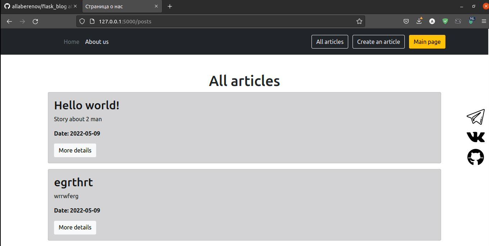

# **Описание** #
___
Приложение `Simple flask-blog` представляет собой простой редактор постов позволяющий публиковать текстовые статьи, а  
также редактировать и удалять их.
Приложение было разработано на языке `Python` с помощью фреймворка [Flask](https://flask.palletsprojects.com/en/2.1.x/).
В разрбатоке веб-страниц использовалась [HTML5](https://en.wikipedia.org/wiki/HTML5), шаблонизатора [Jinja2](https://jinja.palletsprojects.com/en/3.1.x/) и языка [SQL](https://ru.wikipedia.org/wiki/SQL)
___
## **Установка и запуск приложения** ##

### **Установка приложения** ###
Установка программы возможно двумя разными спсобами. Ниже описан каждый метод установки. 
1) Для установки и запуска приложение при помощи `Git`, введите в терминале `Linux` следующие команды:

```
git clone https://github.com/allaberenov/flask_blog.git
cd flask_blog
./script

```
Далее в адресном поле вашего браузера ввести [127.0.0.1:5000](http://127.0.0.1:5000/) после чего вам покажется главная страничка приложения
2) Для установки и запуска приложения этим способом вам понадобиться приложение `Docker`.
Убедитесь что на вашем устройстве заранее установлена эта программа, если же она не установлена, то изучите [материал по установке Docker](https://www.digitalocean.com/community/tutorials/how-to-install-and-use-docker-on-ubuntu-20-04-ru).
Для далее введите в терминал нижеуказанные команды

```commandline
docker pull allaberenov/simple_flask
docker run -d -p 56733:80 --name simple_flask -v $PWD:/app allaberenov/simple_flask

```

   И после этого указав в адресном поле вашего браузера [127.0.0.1:56733](http://127.0.0.1:56733/) вы попадёте на главную страницу приложения.

___
## Использование ##

После запуска приложения и подключения к сереверу вам будет доступна следующая страничка:


Откуда вы можете перейти на страничку для

* создания нового поста
  
  Где вы можете создать новый блог указав при этом название блога, краткую историю блога. 

  `Важно!` При при создании поста **необходимо** заполнить поле заголовки поста.
Создание же постов с пустым аннонсом и текстом допускается. 
Длина символом в аннонсе не должно превосходить 200 символов


* просмотра всех постов




Все данные после завершения работы приложения не теряются, а записываются в базу данных.


